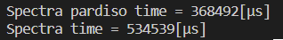

# SpectraSolverPlugin
This plugin provides solver bindings to Spectra. Currently the binding supports using libpardiso600-GNU720-X86-64 for Spectra::GenEigsRealShiftSolver to achieve ~1.5x times speedup.

# Build and Run
You need to get your licence and pardiso binary from the pardiso project and add to your `$ENV{PARDISO_LIC_PATH}` before building and running.
